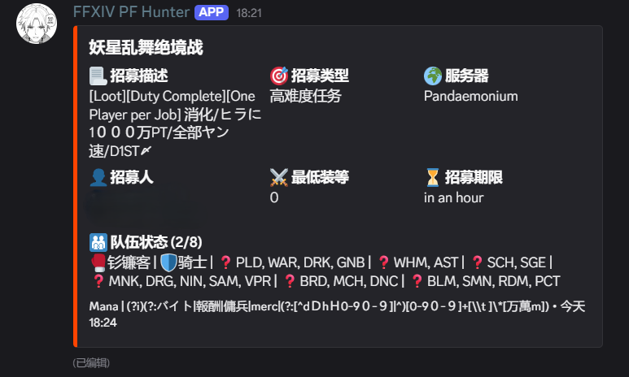

# ffxiv-pfbot

<div align="center">
  
</div>

一款面向《最终幻想 XIV》（FF14）国际服玩家开发的 Discord 招募订阅机器人。

它将定时抓取并解析 [xivpf.com](https://xivpf.com/listings) 上的招募信息，根据正则表达式、数据中心和招募类别筛选队伍，并将符合条件的招募推送到指定的 Discord 频道。

## 功能介绍

项目使用 TypeScript 和 Bun 开发，订阅及投递状态保存在本地 SQLite 数据库中，无需额外部署数据库服务。

| 功能           | 说明                                                                                                             |
| -------------- | ---------------------------------------------------------------------------------------------------------------- |
| 灵活订阅       | 使用 RE2 正则匹配副本名称和招募描述，可组合多个关键词。                                                          |
| 多维筛选       | 数据中心和招募类别均支持多选；同一项内为「或」，不同项与正则之间为「且」，留空表示不限。                         |
| 中文招募卡片   | 展示副本、描述、招募类别、服务器、招募人、最低装等、剩余时间和队伍职业；已收录的副本名称及职业名称使用中文显示。 |
| 自动更新与清理 | 同一频道内按招募 ID 去重，内容变化时编辑原消息，招募消失或到期后删除消息。                                       |
| 持久化与重试   | 保存订阅、消息 ID、内容摘要和到期时间，正常重启后继续处理；投递失败或频道权限恢复后，在后续检查中重试。          |
| 频道独立管理   | 通过斜杠命令和交互菜单管理当前频道的订阅，支持文字频道、公告频道及公开、私密、公告线程。                         |

推送与清理规则如下：

- **同一招募只发一条消息。** 同一频道的多个订阅匹配同一个招募 ID 时，合并展示匹配到的正则；网站列表中的重复 ID 也会先去重。
- **内容变化时更新原消息。** 内容摘要不变时跳过编辑；原消息被手动删除后，会在下一次仍匹配且内容发生变化时补发。
- **新订阅可以匹配现有招募。** 取消订阅后，仍存续的招募保留投递记录，避免重新订阅时重复发送。
- **招募结束后自动清理。** 招募从成功解析的网站列表中消失，或已记录的期限到达后，删除对应消息和投递记录。取消频道的全部订阅后，原有消息仍会继续清理，清理过程不会删除订阅设置。
- **抓取失败时保留有效消息。** 不把请求失败或异常页面当成空列表，本轮仅根据数据库中已记录的到期时间清理。发送、编辑或删除失败时保留相应状态，后续检查中重试。
- **权限异常时保留订阅。** 频道暂时不可访问、机器人被禁言或发送权限不足时暂停投递；恢复后，仍符合订阅条件的招募会继续处理。

## 使用方法

### 0. 环境要求

- **Bun 1.4.2 或更新版本**：运行 TypeScript，并使用内置的 `bun:sqlite` 和定时任务。
- **Git**：克隆项目及获取游戏数据子模块。
- 部署环境能够访问 Discord 和 xivpf.com。

### 1. 创建并邀请 Discord 机器人

在 Discord Developer Portal 中创建应用和机器人，获取 Bot Token。邀请机器人进入服务器时，选择 `bot` 和 `applications.commands` scopes，并为目标频道配置以下权限：

| 使用场景           | 机器人所需权限                   |
| ------------------ | -------------------------------- |
| 文字频道、公告频道 | 查看频道、发送消息、嵌入链接     |
| 线程               | 查看频道、发送线程消息、嵌入链接 |

私密线程中，机器人还必须已加入线程，或具有管理线程权限；建议直接将机器人加入需要推送的线程。线程不能处于归档或锁定状态。论坛频道需要在帖子对应的线程内使用命令。向公告频道发送消息不会自动发布到关注者频道。

管理订阅的用户需要拥有当前频道的**查看频道**和**管理频道**权限，操作按钮或菜单时也会重新检查权限。机器人本身无需管理员、管理频道或管理消息权限；仅启用 `Guilds` intent，无需开启 Message Content 或 Guild Members 特权 intent。

### 2. 安装项目

如果尚未安装 Bun，可通过 npm 安装：

```bash
npm install -g bun
```

克隆仓库并安装依赖：

```bash
git clone https://github.com/LolipopJ/ffxiv-pfbot.git
cd ffxiv-pfbot
bun install
```

安装时的 `prepare` 脚本会配置 Husky，并初始化、更新 `ffxiv-data` 游戏数据子模块，因此需要能够访问对应的 Git 仓库。项目已包含生成的翻译词典，日常启动无需重新构建。

### 3. 配置环境变量

在项目根目录创建 `.env` 文件，填写必要的 `DISCORD_BOT_TOKEN`：

```env
DISCORD_BOT_TOKEN="your-bot-token-here"
```

全部环境变量如下表所示：

| 环境变量            | 必填 | 默认值                       | 说明                                               |
| ------------------- | ---- | ---------------------------- | -------------------------------------------------- |
| `DISCORD_BOT_TOKEN` | 是   | -                            | Discord 机器人的 Bot Token。                       |
| `FETCH_CRON`        | 否   | `*/5 * * * *`                | 招募检查的 Cron 表达式，使用运行环境的本地时区。   |
| `DATABASE_PATH`     | 否   | `data/pfbot.sqlite`          | SQLite 数据库路径，父目录会自动创建。              |
| `XIVPF_URL`         | 否   | `https://xivpf.com/listings` | 抓取地址；调试时可替换为具有相同 HTML 结构的页面。 |

### 4. 启动机器人

```bash
bun run start
```

机器人上线后，会为已加入的服务器自动注册斜杠命令，加入新服务器时也会自动注册。监控启动约 5 秒后执行首次检查，随后按 `FETCH_CRON` 周期运行；没有订阅、投递记录或待清理的过期标记时跳过抓取。

### 5. 在 Discord 中管理订阅

在需要接收推送的频道或线程中使用以下命令。创建、查看、编辑和取消订阅均限定在**当前服务器及当前频道**。

| 命令示例              | 用途                                                                     |
| --------------------- | ------------------------------------------------------------------------ |
| `/subscribe`          | 打开订阅表单，一次填写正则表达式、数据中心和招募类别后提交保存。         |
| `/list page:1`        | 查看当前频道的订阅，每页 5 条，可通过按钮翻页。                          |
| `/edit page:1`        | 从分页菜单选择订阅，在预填表单中修改正则、数据中心和招募类别后提交保存。 |
| `/unsubscribe page:1` | 从菜单中选择要取消的订阅，每页最多 25 个选项，可通过按钮翻页。           |

`page` 可以省略，默认显示第 1 页，每页最多 25 个可编辑订阅。输入 `/subscribe` 命令打开弹窗表单，其中 `keyword` 为必填的 RE2 正则表达式，数据中心和招募类别支持多选，留空表示不按照数据中心和招募类别进行过滤。使用 `/edit` 命令可以编辑已有的招募订阅，新条件在下一轮检查中生效。

管理回复仅对命令发起人可见，按钮、菜单和表单绑定发起用户、频道及会话，每个分页或设置会话在**两分钟**后失效。关闭弹窗或超时不会保存，只有提交完整表单后才会创建或修改订阅。提交时会重新检查用户及机器人权限；无效正则或与当前频道其他订阅重复的条件会被拒绝，原订阅保持不变。

例如，订阅 Mana 数据中心的高难度招募：

1. 输入 `/subscribe`。
2. 在弹窗的正则表达式输入框中填写 `(?i)(Ultimate|Savage)`。
3. 在同一表单的数据中心菜单中选择 `Mana (JP)`。
4. 在招募类别菜单中选择「高难度任务」。
5. 提交表单，等待下一轮检查推送符合条件的招募。

又如，订阅佣兵招募信息，可以填写正则表达式 `(?i)(?:バイト|報酬|傭兵|merc|(?:[^dｄhｈ0-9０-９]|^)[0-9０-９]+[\t　]*[万萬m])`。

#### 正则匹配说明

正则长度为 **1–1000 字符**，使用 RE2JS 语法，默认区分大小写，可通过 `(?i)` 忽略大小写。匹配对象为**网站原始副本名称与招募描述拼接后的文本**；推送卡片中的中文副本译名不参与匹配。

| 正则示例                 | 匹配效果                                       |
| ------------------------ | ---------------------------------------------- |
| `Ultimate`               | 包含 `Ultimate` 的副本名称或招募描述。         |
| `(?i)(Ultimate\|Savage)` | 包含 Ultimate 或 Savage，忽略大小写。          |
| `(?i)(practice\|prog)`   | 包含 practice 或 prog，忽略大小写。            |
| `.*`                     | 匹配所有招募，仍受所选数据中心和招募类别限制。 |

## 项目开发

```bash
# 启动机器人
bun run start

# 检查代码风格
bun run lint

# 自动修复可修复的格式和风格问题
bun run lint:fix

# 检查 TypeScript 类型
bun run typecheck

# 运行测试
bun run test
```

### 技术栈

| 组件                      | 用途                                            |
| ------------------------- | ----------------------------------------------- |
| TypeScript + Bun          | 业务逻辑、运行时、定时调度和测试。              |
| discord.js                | Discord 连接、斜杠命令、交互组件和 Embed 消息。 |
| Cheerio                   | 解析 xivpf.com 的招募页面。                     |
| RE2JS                     | 校验并执行订阅正则表达式。                      |
| `bun:sqlite`              | 保存订阅、投递记录及过期标记。                  |
| ESLint + Prettier + Husky | 代码检查、格式化及提交前检查。                  |

### 项目结构

```text
ffxiv-pfbot/
├── src/
│   ├── index.ts                   # 入口、命令加载与注册、进程关闭
│   ├── commands/                  # subscribe、list、edit、unsubscribe 命令
│   ├── services/
│   │   ├── fetcher.ts             # 抓取及解析招募页面
│   │   ├── monitor.ts             # 定时检查、匹配、投递及清理
│   │   ├── store.ts               # SQLite 数据存储
│   │   ├── subscription-form.ts   # 创建及编辑订阅的筛选表单
│   │   └── subscription-pager.ts  # 查看、编辑及取消订阅的分页交互
│   ├── utils/                     # 权限检查、消息构建、时间解析和日志
│   ├── locales/                   # 中文标签及本地化入口
│   ├── constants/dict-zh-cn.ts    # 自动生成的副本名称翻译词典
│   └── types/                     # 命令及招募数据类型
├── scripts/build-dict.ts          # 翻译词典构建脚本
├── tests/                        # 自动化测试
├── ffxiv-data/                   # 游戏数据 Git 子模块
└── docs/preview.png              # 推送效果预览
```

### 更新翻译词典

词典来自 `ffxiv-data` 子模块中的英文及简体中文 `ContentFinderCondition.csv`。更新游戏数据后，执行：

```bash
git submodule update --init --remote --depth 1
bun run build:dict
```

构建脚本按行键关联英文和中文名称，生成 `src/constants/dict-zh-cn.ts` 并使用 Prettier 格式化。生成文件应通过脚本更新；未收录的副本名称会在推送中保留原文。

### 扩展与维护

- **添加命令**：在 `src/commands/` 中新增 `.ts` 文件，导出 `data`（`SlashCommandBuilder`）和 `execute`（异步处理函数），入口会自动加载并注册。命令契约见 `src/types/command.ts`。
- **调整筛选项或中文标签**：检查 `src/locales/zh-cn.ts` 及相关类型定义，并保持订阅校验、交互菜单和监控筛选一致。
- **适配页面变化**：修改 `src/services/fetcher.ts` 的解析逻辑，并用页面样例验证正常列表、空列表和异常页面。
- **调整推送展示**：修改 `src/utils/embed.ts`，保留 Markdown 转义、长度限制和队伍空位信息。

<details>
<summary>监控实现与排查说明</summary>

- **存储一致性**：SQLite 使用 WAL、FULL 同步、5 秒写入等待、唯一约束及事务保护更新。`subscriptions` 保存订阅，`deliveries` 保存消息 ID 和内容摘要，`expired_listings` 保存过期标记。投递记录的 `created_at`、`updated_at` 和 `expires_at` 分别为首次创建、最后观察及实际到期时间，均使用 Unix 毫秒时间戳。
- **期限刷新**：每轮成功抓取后，使用统一观察时间加上网站剩余时间计算绝对到期时间，并在清理前批量更新已有投递记录。即使内容未变化、订阅已取消或频道暂时不可访问，也会刷新观察时间和期限，避免刷新后的招募被旧期限误删。无法解析的期限保留原值；新投递按首次观察后 1 小时到期处理，并记录警告。
- **过期状态**：到期招募在删除消息前写入过期标记，重启后仍保留。成功抓取确认 ID 已消失，或同一 ID 刷新为尚未到期的招募时，解除标记；抓取失败或期限无法解析时保留。即使已没有订阅及投递记录，仍会检查剩余标记。标记仅在每轮临时加载，删除成功的消息也会同步移出本地缓存。
- **失败处理**：发送或编辑失败不保存新的消息 ID 或内容摘要，已有记录的期限仍会根据成功抓取的数据更新。删除失败保留记录等待重试；消息已被手动删除时直接清理记录，Discord 确认频道已删除时清理该频道的投递记录。
- **抓取边界**：每次 HTTP 抓取（含正文读取）最多等待 30 秒，解压后的 HTML 上限为 16 MiB。非 HTML 响应、缺失列表容器或缺失招募 ID 会报错，等待下一轮重试。
- **消息展示**：过长的队伍字段会隐藏空位的可选职业列表，同时保留空位和已入队职业；其他字段也遵守 Discord 长度限制。招募描述以转义后的纯文本显示，长正则在列表中缩略展示。卡片发布时间按「观察时间 + 剩余时间 − 1 小时」近似推算，支持秒、分钟、小时和 `a/an` 单数形式；期限无法识别或超过 1 小时时不显示时间戳。内容摘要不包含该时间戳，避免仅因时间推算变化而重复编辑。
- **日志排查**：控制台日志统一采用 `[UTC 时间] [级别] [模块] 消息` 格式，并附带服务器、频道、招募和消息 ID 等上下文。日志覆盖启动与关闭、命令注册、订阅变更、抓取耗时、消息投递和清理；每轮检查汇总发送、编辑、清理及失败次数。

</details>
